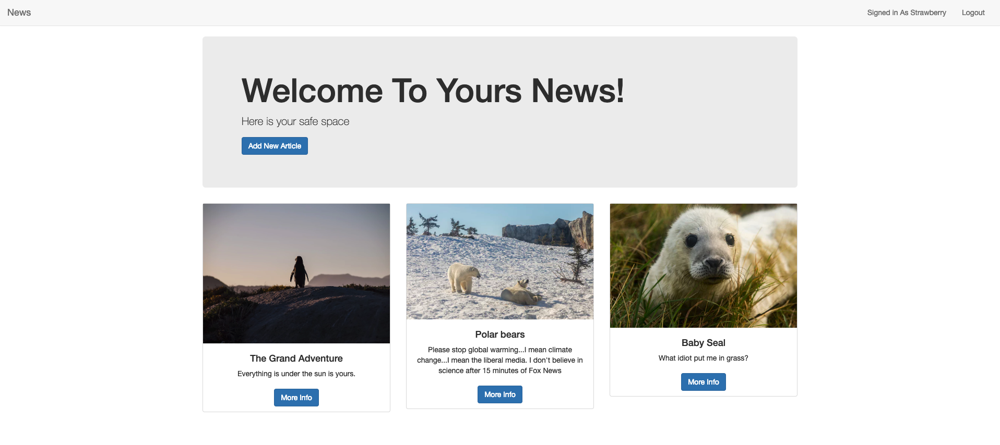

# Image-Board

Gamer: 27 
  Highly skilled gamer with people who want him to start a team.  Would like a private image board for his Discord server.  That would only have the finest memes, trolls, and an area where people can 
discuss the status of their game or Discord server. Is the admin and regulates the server and gives accounts out to people who have earned them.

Female 32:
  Doesn't want to have a Facebook, Instagram or other mainstream medias but would love to post personal photos and write comments, or even stories behind them. Could be use to show engagement photos, baby photos, fun nights out with friends.  With this image/message board not so many intimate details of her life are being so readily available to the world.  

Grandma 75:
  Doesn't understand the complexities of Facebook, doesn't want her information stored anywhere.  This is a website one of her grandchildren
could send her a link to and she can see what is going on in their life.  

The point of the app is to foster a sense of community through people who have developed a close bond through another medium.  Thensocialize and express themselves.  Especially for those who sometimes can not express their thoughts in person.  

User Story: Is new to the group and wants to login and create an account then read through post.  Then comment to contribute to any discussion he participates in.  He also wants to be able to read the website on his phone or tablet.  

# Image-Board

